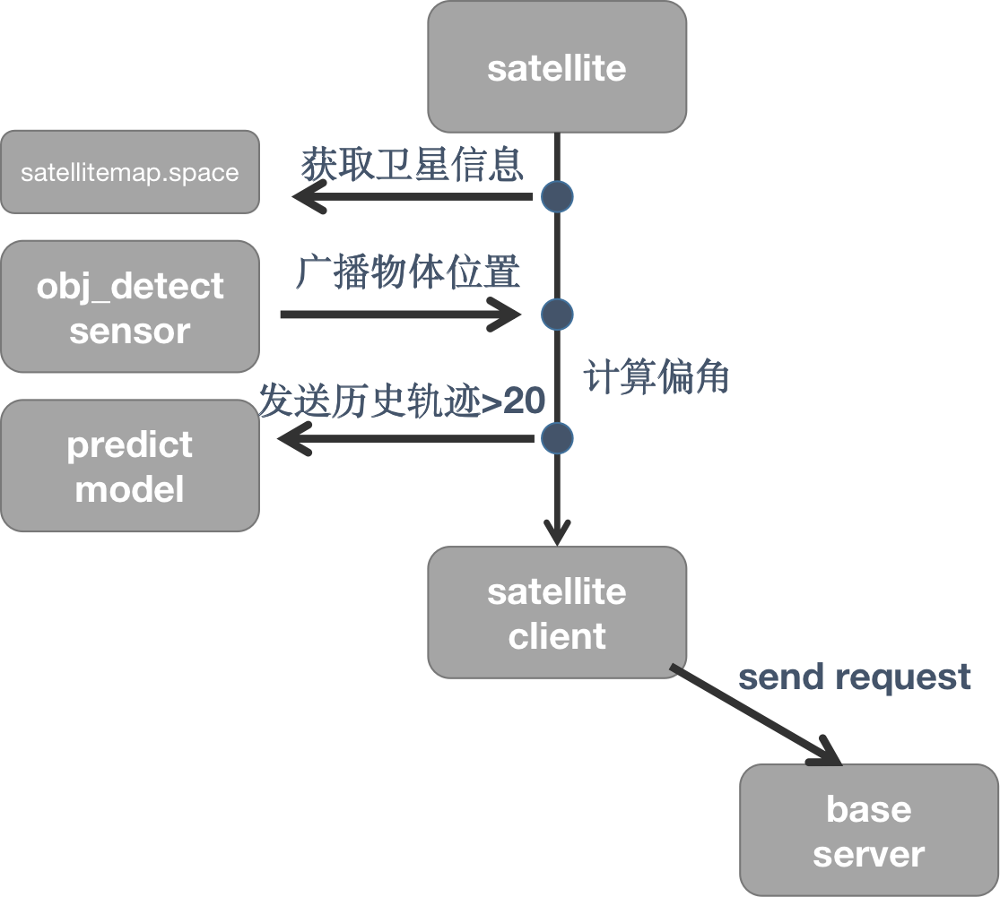

# README

## 进度



1. 生成轨迹
    ```shell
    python obj_detect_server.py
    ```


2. 模拟base
    ```shell
   python base_test_server.py
   ```
3. 卫星端发送请求
   ```shell
   python satellite_client.py
   ```


## TODO

- [ ] 处理拍照请求


### .

编译proto文件

```shell
 python -m grpc_tools.protoc --python_out=. --grpc_python_out=. -I. filename.proto
```

